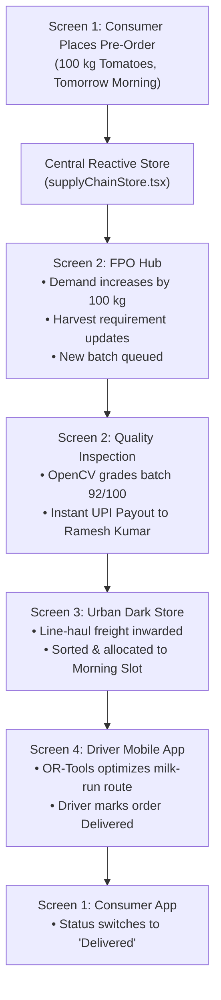

# AgriSetu: Full-Stack Agriculture Supply Chain Platform (SIH Prototype)

A clean, modern, responsive, and visually polished farm-to-fork agricultural supply chain prototype connecting:
**Consumers & Bulk Institutional Buyers → Rural FPOs & Farmers → Urban Micro-Fulfilment Hubs (Dark Stores) → Delivery Drivers**.

Built for college and **Smart India Hackathon (SIH)** demonstrations with a **centralized reactive data layer**, pluggable AI/ML service abstractions, and an **interactive 10-milestone Presentation Demo Mode**.

---

## 🚀 Quick Start & How to Run

### Option 1: Modern Vite Dev Server (Recommended)

1. Open PowerShell or Terminal in the project directory:
   ```powershell
   cd C:\Users\gurup\.gemini\antigravity\scratch\agri-supply-chain
   ```
2. Start the development server:
   ```powershell
   npm run dev
   ```
3. Open your browser at:
   ```
   http://localhost:5173
   ```

### Option 2: Python Instant Server (Zero Node Dependencies)
If presenting on an evaluation PC without Node.js installed, simply run the built production bundle:
```powershell
cd C:\Users\gurup\.gemini\antigravity\scratch\agri-supply-chain\dist
python -m http.server 3000
```
Then visit `http://localhost:3000`.

---

## 📱 The 4 Major Interfaces

### Screen 1 — Consumer & Bulk Buyer App
- **Purpose**: Demand Generation & Pre-Order Placement.
- **Key Features**:
  - Live commodity discovery (Tomatoes, Onions, Potatoes, Carrots, Beans, Bananas, Rice, Wheat).
  - **AgMarknet 2.0 APMC Mandi Benchmark comparison** showing direct farmgate platform price vs open mandi rates (e.g. Save ₹4/kg on Tomatoes).
  - Institutional bulk quantity quick-selects (**50 kg, 100 kg, 250 kg, 500 kg**).
  - Flexible delivery slot picker (**Tomorrow Morning, Tomorrow Afternoon, Tomorrow Evening**).
  - Pre-order confirmation modal with instant **"Demand sent to FPO network"** propagation.
  - Active orders tracker showing 4-phase logistics status.

### Screen 2 — Rural FPO Hub Portal
- **Purpose**: Demand Aggregation, Harvest Planning, Computer Vision Grading & Farmer Digital Payout.
- **Key Features**:
  - 5 Executive KPI Cards: Today's Demand, Harvest Required, Active Farmers, Pending Batches, Farmer Payout.
  - **AI Demand Forecast Chart** powered by **XGBoost / Prophet** time-series projections with historical, actual, and confidence intervals.
  - Incoming demand aggregation table with commodity breakdown and priority flags.
  - **Computer Vision Quality Grading (OpenCV / YOLOv8-Agri)** modal:
    - Quality Score: 92/100, Grade A, Caliber Size, Color Uniformity (95%), Defect Rate (2.1%).
  - **Farmer Digital Payout Trigger**:
    - Calculates net payout post-defect deduction (e.g. ₹7,840 for Ramesh Kumar).
    - 1-click UPI disbursement simulation generating live transaction references (`UPI-XXXXXX`).

### Screen 3 — Urban Dark Store Dashboard (MFC-04)
- **Purpose**: Freight Inwarding, Batch Sorting, FEFO Binning & Fleet Slotting.
- **Key Features**:
  - Executive KPIs: Incoming Batches (18), Today's Orders (146), Orders Ready (92), Dispatch Pending (31).
  - Cold-chain chiller telemetry monitoring (Optimal 4.2°C).
  - Incoming line-haul freight arrivals table with 1-click **Inward Freight** action.
  - **Interactive 6-Stage Batch Sorting Workflow**:
    `Received → Quality Checked → Sorted → Packed → Slotted → Ready`.
  - **Smart Slot Allocation** (Morning 48, Afternoon 56, Evening 42 orders).
  - Live FEFO inventory capacity bars with threshold alerts.

### Screen 4 — Driver Mobile App
- **Purpose**: Dynamic Route Optimization & Last-Mile Delivery Execution.
- **Key Features**:
  - Driver Profile: Arun Gowda (Tata Ace Gold EV • KA-04-E-8812), Status: **On Route**.
  - **Interactive Bengaluru Delivery Route Map** with numbered stop pins and depot hub.
  - **AI Route Optimization Panel**:
    - Powered by **Google OR-Tools + OSRM Road Graph**.
    - Metrics: 42.6 km, 2h 18m, 4 urban clusters, 1.5 tonnes vehicle capacity (82% used).
    - Sequential route pills: `Stop 1 → Stop 2 → Stop 3 → Stop 4 → Stop 5`.
  - Delivery stop cards with cargo manifests and 1-click **"Mark Delivered"** digital POD.

---

## 🔄 How the 4 Screens are Connected (Shared Data Architecture)

All 4 interfaces consume a single reactive state store in `src/store/supplyChainStore.tsx`:



---

## 📁 Project Directory Structure

```
agri-supply-chain/
├── index.html                     # HTML5 entry with Google Fonts & favicon
├── package.json                   # React 18, TypeScript, Tailwind, Lucide dependencies
├── tsconfig.json                  # Strict TypeScript configuration
├── vite.config.ts                 # Vite bundler configuration
├── tailwind.config.js             # AgriTech design system (emerald greens, slate neutrals)
├── src/
│   ├── main.tsx                   # React root mount
│   ├── App.tsx                    # Main layout with screen switcher & demo bar
│   ├── index.css                  # Tailwind styles and scrollbar utilities
│   ├── types/
│   │   └── supplyChain.ts         # TypeScript definitions for all 7 entities
│   ├── data/
│   │   └── mockData.ts            # Central editable Indian agricultural datasets
│   ├── store/
│   │   └── supplyChainStore.tsx   # React Context state engine & lifecycle dispatchers
│   ├── services/                  # Pluggable Service Abstractions
│   │   ├── marketPriceService.ts  # AgMarknet 2.0 API connector abstraction
│   │   ├── demandForecastService.ts# XGBoost / Prophet forecast model interface
│   │   ├── qualityGradingService.ts# OpenCV / Computer Vision grading interface
│   │   └── routeOptimizationService.ts # Google OR-Tools + OSRM route planner
│   └── components/
│       ├── layout/
│       │   ├── TopNavBar.tsx       # Screen switcher, phone bezel toggle & reset button
│       │   ├── DemoWorkflowBar.tsx # 10-milestone presentation demo controller
│       │   ├── DeviceFrame.tsx     # Smartphone bezel simulator for B2C & Driver apps
│       │   └── ToastContainer.tsx  # Live transaction alerts and notifications
│       ├── screen1-consumer/
│       │   └── ConsumerApp.tsx     # B2C & Institutional discovery, AgMarknet comparison
│       ├── screen2-fpo/
│       │   └── FpoDashboard.tsx    # Rural FPO portal, AI forecast, CV modal & payout
│       ├── screen3-darkstore/
│       │   └── DarkStoreDashboard.tsx # Urban micro-fulfilment, sorting workflow, slots
│       └── screen4-driver/
│           └── DriverApp.tsx       # Mobile-first driver dispatch & vector route map
```

---

## 🛠️ Where to Modify Demo Data & Replace Mock APIs

### 1. Modifying Products, Farmers, FPOs, and Hubs
All demo data is centrally isolated in **`src/data/mockData.ts`**:
- **Products & Prices**: Edit `INITIAL_PRODUCTS` array (change name, variety, platform price, mandi benchmark price).
- **Farmers & Payouts**: Edit `INITIAL_FARMERS` array (add farmer names, UPI IDs, villages).
- **FPO Hubs**: Edit `INITIAL_FPOS` array (adjust capacity, locations).
- **Driver & Stops**: Edit `INITIAL_DRIVER` array (modify driver name, vehicle, stops, coordinates).

### 2. Connecting Real APIs & ML Microservices
Every external capability has a dedicated service interface in `src/services/`:

| Capability | Current Mock File | Where to Plug Live Service |
| :--- | :--- | :--- |
| **Market Prices** | `src/services/marketPriceService.ts` | Replace `getMarketPrice()` with `fetch('https://api.data.gov.in/resource/9ef84268...&api-key={KEY}')` |
| **AI Demand Forecast** | `src/services/demandForecastService.ts` | Replace `projectDemandWithNewOrder()` with `POST /api/v1/forecast/predict` (Python XGBoost/Prophet) |
| **Quality Grading** | `src/services/qualityGradingService.ts` | Replace `assayBatch()` with `POST /api/v1/cv/grade-crate` (Python OpenCV / YOLOv8-Agri) |
| **Route Optimization**| `src/services/routeOptimizationService.ts`| Replace `solveRoute()` with `POST /api/v1/routing/vrp` (Google OR-Tools solver + OSRM) |

---

## 🎬 10-Step Presentation / Demo Walkthrough (1 Click)

During an evaluation or SIH presentation, use the **Top Demo Workflow Bar**:
1. Click **"Auto Demo"** to automatically play the complete 10-milestone supply chain journey.
2. Or click **"Next Step"** to manually walk the evaluators through:
   - **Step 1-2**: Consumer selects 100 kg Tomatoes and places pre-order.
   - **Step 3**: FPO Hub demand spikes by 100 kg and AI forecast curves recalibrate.
   - **Step 4**: OpenCV computer vision modal assays Tomato batch HB-1042 (Score 92/100, Grade A).
   - **Step 5**: ₹7,840 instant UPI payout is triggered to farmer Ramesh Kumar.
   - **Step 6-7**: Urban Dark Store inwards line-haul reefer freight and slots into Morning run.
   - **Step 8**: Google OR-Tools computes optimal 42.6 km milk-run route for driver Arun.
   - **Step 9**: Driver clicks "Mark Delivered" at Basavanagudi drop.
   - **Step 10**: Consumer app tracker immediately updates to "Delivered"!
