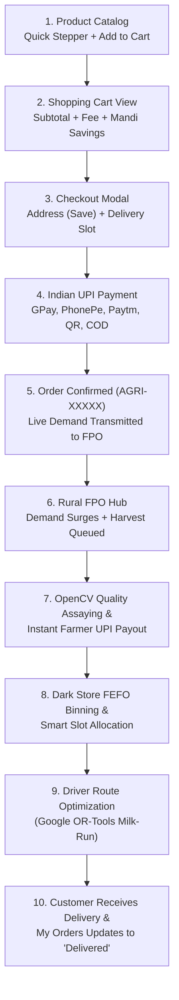

# AgroDirect: Farm-to-Fork Direct Agriculture Marketplace (SIH Prototype)

A clean, modern, responsive, and visually polished farm-to-fork agricultural supply chain prototype connecting:
**Consumers & Bulk Institutional Buyers → Rural FPOs & Farmers → Urban Micro-Fulfilment Hubs (Dark Stores) → Delivery Drivers**.

Built for college and **Smart India Hackathon (SIH)** demonstrations with a **real working shopping cart**, Indian UPI payment flow, **centralized reactive data layer**, pluggable AI/ML service abstractions, and an **interactive 10-milestone Presentation Demo Mode**.

---

## 🚀 Quick Start & How to Run

### Option 1: Modern Vite Server (Running Live)
1. Open PowerShell or Terminal in the project directory:
   ```powershell
   cd C:\Users\gurup\.gemini\antigravity\scratch\agri-supply-chain
   ```
2. Start the development or preview server:
   ```powershell
   npm run preview
   ```
3. Open your browser at:
   ```
   http://localhost:5173
   ```

### Option 2: Python Instant Server (Zero Node Dependencies)
```powershell
cd C:\Users\gurup\.gemini\antigravity\scratch\agri-supply-chain\dist
python -m http.server 3000
```
Then visit `http://localhost:3000`.

---

## 🛒 E-Commerce Shopping & Fulfilment Workflow



---

## 📱 The 4 Connected Interfaces

### Screen 1 — Consumer & Bulk Buyer App (`ConsumerApp.tsx`)
- **Shopping Flow**: Product ➔ Add to Cart ➔ Cart ➔ Address & Slot ➔ UPI Payment ➔ Order Confirmation ➔ My Orders.
- **Cart Persistence**: Stored in `localStorage` so items survive page reloads and screen transitions.
- **AgMarknet 2.0 APMC Mandi Benchmark**: Displays direct platform price vs mandi rates (e.g. Save ₹4/kg).
- **Institutional Bulk Selectors**: Quick buttons for 50 kg, 100 kg, 250 kg, 500 kg.
- **Delivery Slots**: Tomorrow Morning, Tomorrow Afternoon, Tomorrow Evening.

### Screen 2 — Rural FPO Hub Portal (`FpoDashboard.tsx`)
- 5 Executive KPI Cards: Today's Demand, Harvest Required, Active Farmers, Pending Batches, Farmer Payout.
- **AI Demand Forecast Chart**: Responsive multi-horizon curve powered by **XGBoost / Prophet**.
- **Computer Vision Quality Grading (OpenCV / YOLOv8-Agri)**: Defect bounding boxes, Quality Score (92/100), Caliber Size, Color Uniformity (95%), Defect Rate (2.1%).
- **Farmer Digital Payout**: 1-click UPI disbursement simulation (`UPI-XXXXXX`) to farmer Ramesh Kumar.

### Screen 3 — Urban Dark Store Dashboard (`DarkStoreDashboard.tsx`)
- Hub KPIs: Incoming Batches, Today's Orders, Orders Ready, Dispatch Pending.
- Cold-chain chiller telemetry monitoring (Optimal 4.2°C).
- **Interactive 6-Stage Batch Sorting Workflow**: `Received → Quality Checked → Sorted → Packed → Slotted → Ready`.
- **Smart Slot Allocation**: Morning (48), Afternoon (56), Evening (42) orders.

### Screen 4 — Driver Mobile App (`DriverApp.tsx`)
- Driver Profile: Arun Gowda (Tata Ace Gold EV • KA-04-E-8812), Status: **On Route**.
- **AI Route Optimization Panel**: Powered by **Google OR-Tools + OSRM Road Graph** (42.6 km, 2h 18m).
- **Interactive Bengaluru Delivery Route Map**: Numbered stop pins (1 to 5), depot hub, and route polyline.
- **Delivery Stops Queue**: Cargo manifests and 1-click **"Mark Delivered"** digital POD.

---

## ⚙️ Developer / Admin Product & Price Control

Accessible via the **"Price Control"** button in the top navigation bar or catalog banner:
1. **Manual Selling Price Control**: Increase/decrease with quick buttons (`-5`, `-1`, `+1`, `+5`) or direct numeric input.
2. **Immediate Live Propagation**: Changing a price immediately updates:
   - Product Catalog
   - Active Cart (recalculates item total, subtotal, and grand total in real time!)
   - Checkout Total
   - FPO Demand
3. **AgMarknet Separation**: AgMarknet APMC prices remain benchmark reference only and never overwrite platform selling prices.
4. **Product Attributes**: Edit name, grade (Grade A / B / C), available stock, and in-stock toggle.
5. **Add New Commodity**: Add new agricultural produce on the fly during presentations.
